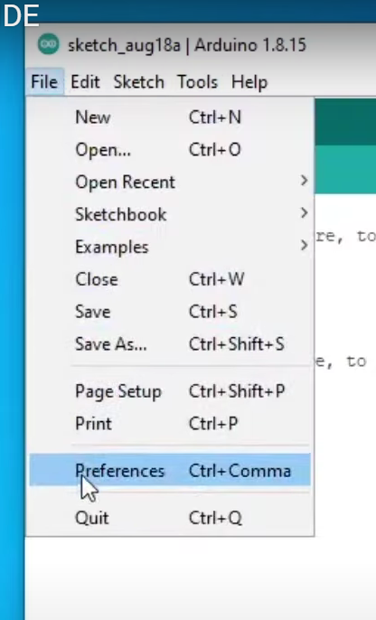
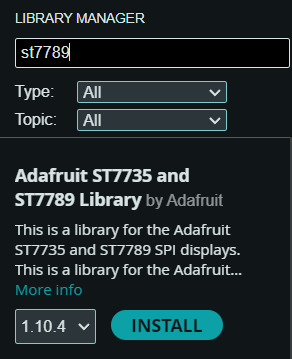

# Conectar ESP32 al arduino

# Install drivers
[drivers to install](https://www.silabs.com/developers/usb-to-uart-bridge-vcp-drivers?tab=downloads)

# libraries
[used fast st7789](https://github.com/cbm80amiga/Arduino_ST7789_Fast.git)

# Youtube tutorial
[tutorial](https://www.youtube.com/watch?v=-nECx4DOE84&t=160s)

