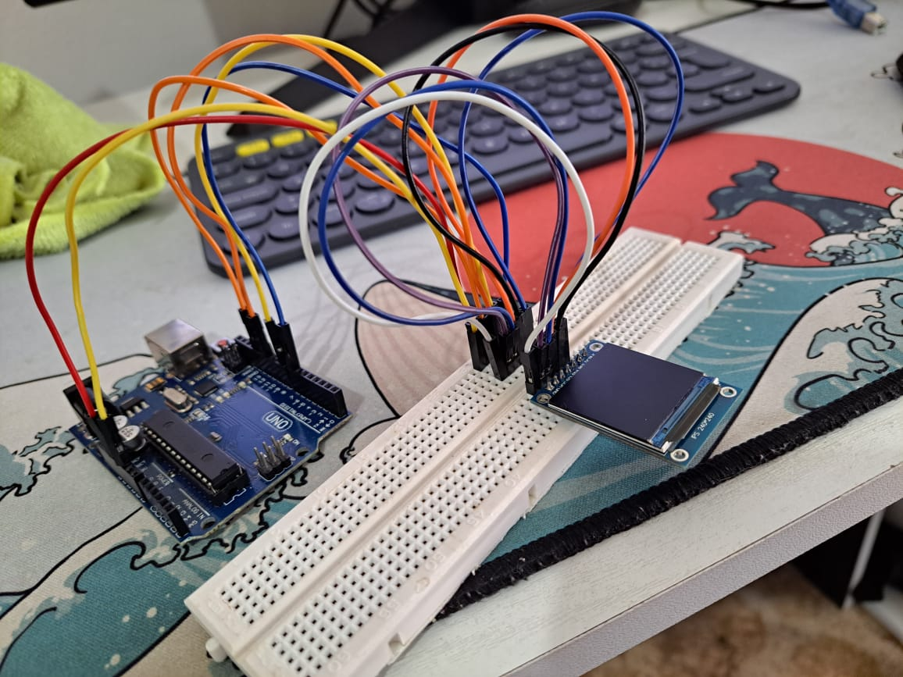

# Conectar y Configurar la Pantalla ST7789

Este documento proporciona instrucciones sobre cómo conectar y configurar la pantalla ST7789 con ESP32, Arduino Uno y Raspberry Pi 4. Encontrarás detalles sobre la instalación de drivers, las conexiones necesarias, las librerías utilizadas y ejemplos de código.

## Tabla de Contenidos

1. [ESP32](#esp32)
   - [Instalación de Drivers](#instalación-de-drivers-en-esp32)
   - [Librerías Utilizadas](#librerías-utilizadas-en-esp32)
   - [Conexiones](#conexiones-en-esp32)
   - [Tutorial de YouTube](#tutorial-de-youtube-en-esp32)
2. [Arduino Uno](#arduino-uno)
   - [Instalación de Drivers](#instalación-de-drivers-en-arduino-uno)
   - [Librerías Utilizadas](#librerías-utilizadas-en-arduino-uno)
   - [Conexiones](#conexiones-en-arduino-uno)
   - [Imágenes de Conexiones](#imágenes-de-conexiones-en-arduino-uno)
   - [Tutorial de YouTube](#tutorial-de-youtube-en-arduino-uno)
3. [Raspberry Pi 4](#raspberry-pi-4)
   - [Librerías Utilizadas](#librerías-utilizadas-en-raspberry-pi-4)
   - [Conexiones](#conexiones-en-raspberry-pi-4)
   - [Script de Ejemplo](#script-de-ejemplo-en-raspberry-pi-4)

---

## ESP32

### Instalación de Drivers en ESP32

Para conectar el ESP32 a tu computadora, es posible que necesites instalar los drivers adecuados para la comunicación USB a UART. Puedes encontrar los drivers necesarios en el siguiente enlace:

[Instalar drivers para ESP32](https://www.silabs.com/developers/usb-to-uart-bridge-vcp-drivers?tab=downloads)


### Librerías Utilizadas en ESP32

Para trabajar con la pantalla ST7789 en el ESP32, utilizaremos la librería `Arduino_ST7789_Fast`. Puedes descargarla desde el siguiente enlace:

[Descargar Arduino_ST7789_Fast](https://github.com/cbm80amiga/Arduino_ST7789_Fast.git)


### Conexiones en ESP32

Conecta la pantalla ST7789 al ESP32 de la siguiente manera:

| Pin ST7789 | Pin ESP32 |
|------------|-----------|
| VCC        | 3.3V      |
| GND        | GND       |
| SCL        | GPIO 13   |
| SDA        | GPIO 11   |
| RES        | GPIO 8    |
| DC         | GPIO 7    |

### Tutorial de YouTube en ESP32

Para una guía visual sobre cómo conectar y programar el ESP32 con la pantalla ST7789, puedes ver el siguiente tutorial de YouTube:

[Tutorial de YouTube para ESP32](https://www.youtube.com/watch?v=-nECx4DOE84&t=160s)

---

## Arduino Uno

### Instalación de Drivers en Arduino Uno

El Arduino Uno generalmente no requiere la instalación de drivers adicionales en la mayoría de los sistemas operativos. Sin embargo, si experimentas problemas de conexión, puedes visitar el sitio oficial de Arduino para descargar los drivers necesarios.

### Librerías Utilizadas en Arduino Uno

Para trabajar con la pantalla ST7789 en el Arduino Uno, utilizaremos la librería `Arduino_ST7789_Fast`. Puedes descargarla desde el siguiente enlace:

[Descargar Arduino_ST7789_Fast](https://github.com/cbm80amiga/Arduino_ST7789_Fast.git)


### Conexiones en Arduino Uno

Conecta la pantalla ST7789 al Arduino Uno de la siguiente manera:

| Pin ST7789 | Pin Arduino Uno |
|------------|-----------------|
| VCC        | 3.3V            |
| GND        | GND             |
| SCL        | Pin 13          |
| SDA        | Pin 11          |
| RES        | Pin 8           |
| DC         | Pin 7           |

**Nota:** Asegúrate de alimentar la pantalla ST7789 con 3.3V. Conectar a 5V puede dañar el display.

### Imágenes de Conexiones en Arduino Uno




### Tutorial de YouTube en Arduino Uno

Para una guía visual sobre cómo conectar y programar el Arduino Uno con la pantalla ST7789, puedes ver el siguiente tutorial de YouTube:

[Tutorial de YouTube para Arduino Uno](https://www.youtube.com/watch?v=-nECx4DOE84&t=160s)

---

## Raspberry Pi 4

### Librerías Utilizadas en Raspberry Pi 4

Para manejar la pantalla ST7789 en la Raspberry Pi 4, utilizaremos las librerías `Pillow` y `luma.lcd`. Puedes instalarlas utilizando los siguientes comandos:

```bash
sudo apt-get update
sudo apt-get install python3-pip
sudo pip3 install pillow luma.lcd
