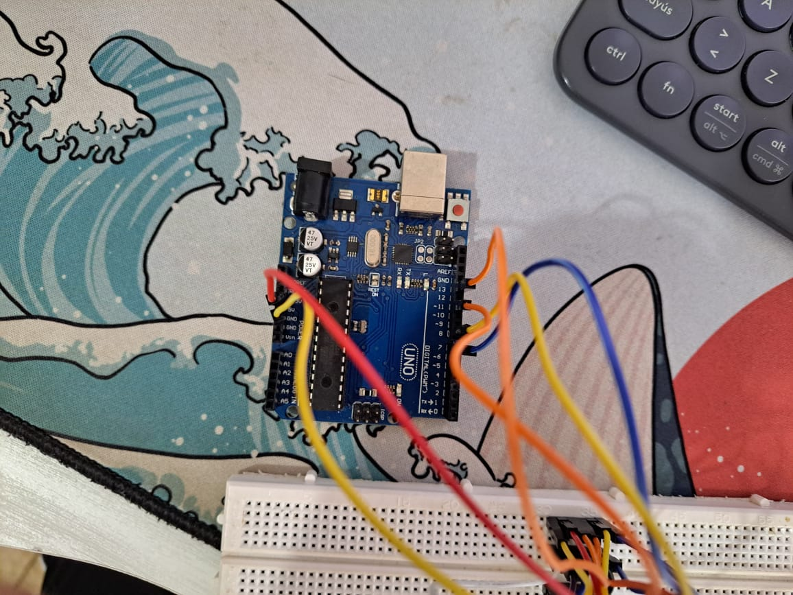

# Conectar y Configurar la Pantalla ST7789

Este documento proporciona instrucciones sobre cómo conectar y configurar la pantalla ST7789 con Arduino Uno. Encontrarás detalles sobre la instalación de drivers, las conexiones necesarias, las librerías utilizadas.

## Tabla de Contenidos

1. [Arduino Uno](#arduino-uno)
   - [Instalación de Drivers](#instalación-de-drivers-en-arduino-uno)
   - [Librerías Utilizadas](#librerías-utilizadas-en-arduino-uno)
   - [Conexiones](#conexiones-en-arduino-uno)
   - [Imágenes de Conexiones](#imágenes-de-conexiones-en-arduino-uno)
   - [Tutorial de YouTube](#tutorial-de-youtube-en-arduino-uno)

---

## Arduino Uno

### Librerías Utilizadas en Arduino Uno

Para trabajar con la pantalla ST7789 en el Arduino Uno, utilizaremos la librería `Arduino_ST7789_Fast`. Puedes descargarla desde el siguiente enlace:

[Descargar Arduino_ST7789_Fast](https://github.com/cbm80amiga/Arduino_ST7789_Fast.git)

### Conexiones en Arduino Uno

Conecta la pantalla ST7789 al Arduino Uno de la siguiente manera:

| Pin ST7789 | Pin Arduino Uno |
|------------|-----------------|
| VCC        | 3.3V            |
| GND        | GND             |
| SCL        | Pin 13          |
| SDA        | Pin 11          |
| RES        | Pin 8           |
| DC         | Pin 7           |

**Nota:** Asegúrate de alimentar la pantalla ST7789 con 3.3V. Conectar a 5V puede dañar el display.

### Imágenes de Conexiones en Arduino Uno

### Tutorial de YouTube en Arduino Uno

Para una guía visual sobre cómo conectar y programar el Arduino Uno con la pantalla ST7789, puedes ver el siguiente tutorial de YouTube:

[Tutorial de YouTube para Arduino Uno](https://www.youtube.com/watch?v=-nECx4DOE84&t=160s)

---